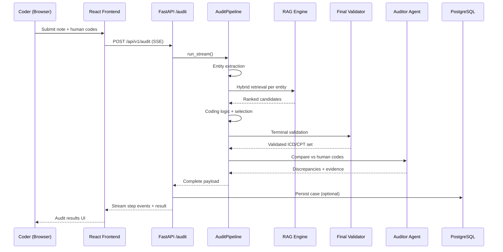

# CodePerfectAuditor

**AI-powered Clinical Coding Audit & Revenue Integrity Platform for ICD-10 and CPT validation.**

| | |
|---|---|
| **Frontend** | [http://161.118.217.29:3000/login](http://161.118.217.29:3000/login) |
| **API Documentation** | [http://161.118.217.29:8000/docs](http://161.118.217.29:8000/docs) |

---

## Overview

**CodePerfectAuditor** is an agentic AI platform that audits medical coding in real time. It reads clinical documentation—operative notes, admission summaries, and discharge records—and validates ICD-10 and CPT assignments **before** claims are submitted.

The system is built for **Revenue Integrity**: helping hospitals capture appropriate reimbursement while maintaining coding compliance. Rather than a single black-box model, the platform combines deterministic clinical extraction, retrieval-augmented coding knowledge, multi-stage validation, and human-in-the-loop review workflows.

---

## Key Features

| Capability | Description |
|------------|-------------|
| **Real-time coding audit** | Streamed pipeline with step-by-step progress for coders |
| **ICD-10 & CPT validation** | Diagnosis and procedure code sets with evidence grounding |
| **Human vs AI comparison** | Auditor Agent surfaces missed, unsupported, and mismatched codes |
| **Evidence highlighting** | Supporting spans linked to each recommended code |
| **Case workflow** | Draft → submit → review → approve/reject with audit trail |
| **Role-based access** | Separate experiences for coders, reviewers, and administrators |
| **Hybrid RAG retrieval** | Dense + sparse search over a large medical knowledge index |
| **Governance validators** | Terminal validation layer before codes reach the client |
| **Docker-ready deployment** | Containerized frontend and backend for consistent environments |

---

## Role-Based Access Control

| Role | Responsibilities |
|------|----------------|
| **Coder** | Upload or paste clinical notes, enter human code sets, run audits, review AI output, submit cases for review |
| **Reviewer** | Access case queue, inspect discrepancies and evidence, approve or reject submissions, update final code sets |
| **Admin** | Manage users and organizations, assign reviewers, monitor analytics, run system evaluation jobs |

---

## Target Users

| User Group | How They Benefit |
|------------|------------------|
| **Medical Coders** | Pre-submission validation and discrepancy detection |
| **CDI Teams** | Documentation alignment with billed codes |
| **Revenue Integrity Teams** | Reduced leakage and overcoding risk |
| **Hospital Auditors** | Traceable defense trail per chart |
| **Compliance Teams** | Evidence-backed coding decisions |
| **Healthcare Administrators** | Workflow oversight and operational analytics |

---

## Technology Stack

| Layer | Technologies |
|-------|----------------|
| **Frontend** | React 18, Vite, React Router, Axios, Recharts |
| **Backend** | FastAPI, Uvicorn, SQLAlchemy (async), Pydantic |
| **Database** | PostgreSQL |
| **Vector store** | Qdrant (production) with ChromaDB fallback |
| **Cache** | Redis (optional audit result caching) |
| **ML / NLP** | sentence-transformers, cross-encoder reranking, SapBERT |
| **LLM** | Groq API (structured JSON coding assistance) |
| **Auth** | JWT (access + refresh), bcrypt password hashing |
| **Deployment** | Docker, docker-compose |

---

## System Architecture

```
┌─────────────────────────────────────────────────────────────────────────┐
│                         CodePerfectAuditor Platform                      │
├─────────────────────────────────────────────────────────────────────────┤
│                                                                          │
│   ┌──────────────┐         HTTPS / SSE          ┌──────────────────┐   │
│   │   React SPA  │ ◄──────────────────────────► │  FastAPI Backend │   │
│   │  (Vite)      │         REST + JWT           │  /api/v1         │   │
│   └──────────────┘                              └────────┬─────────┘   │
│                                                          │               │
│                    ┌─────────────────────────────────────┼───────┐       │
│                    │                                     │       │       │
│                    ▼                                     ▼       ▼       │
│            ┌──────────────┐                    ┌────────────┐  ┌────┐  │
│            │  PostgreSQL  │                    │   Qdrant   │  │Redis│  │
│            │  Cases/Users │                    │  Vectors   │  │Cache│  │
│            └──────────────┘                    └────────────┘  └────┘  │
│                                                                          │
└─────────────────────────────────────────────────────────────────────────┘
```

**Data flow (summary):** Clinical note enters the API → PHI-safe processing → AI pipeline → validated codes and discrepancies → persisted case record → rendered in the web client.

---

## Frontend Architecture

The client is a **React + Vite** single-page application with role-gated routing.

| Area | Implementation |
|------|----------------|
| **Coder workspace** | Note upload, human code entry, streaming audit progress, results tabs |
| **Case history** | Searchable case list, status management, reviewer actions |
| **Audit results** | Summary, code comparison, explainability, removed codes, evidence viewer |
| **Analytics** | Revenue and trend views for reviewers and admins |
| **Authentication** | Login, demo sessions, token refresh, session persistence |

**Primary routes:** `/` (coder dashboard), `/case-history`, `/analytics`, `/users`, `/evaluation` (admin).

State is managed through React Context (`AuthContext`, `AuditContext`) with optional `sessionStorage` recovery for in-progress audits.

---

## Backend Architecture

The API layer is **FastAPI** with modular routers and async database access.

| Component | Role |
|-----------|------|
| **`main.py`** | Application entry, CORS, lifespan warmup (DB + RAG engine) |
| **`api/routes.py`** | Streaming audit and feedback endpoints |
| **`api/case_routes.py`** | Case lifecycle and reviewer workflows |
| **`api/auth_routes.py`** | Authentication and user administration |
| **`services/audit_pipeline.py`** | End-to-end orchestration |
| **`agents/`** | Coding logic, auditor, and evidence agents |

On startup, the backend initializes the database and preloads retrieval models so the first audit request does not pay a cold-start penalty.

---

## AI Pipeline Workflow

```
Clinical Note
      │
      ▼
Entity Extraction          ← deterministic ontology + section-aware parsing
      │
      ▼
RAG Retrieval              ← per-entity hybrid search (dense + BM25)
      │
      ▼
Coding Logic Agent         ← candidate pool + structured code selection
      │
      ▼
Rule Engine                ← hierarchy upgrades, mandatory groups, injections
      │
      ▼
Selection Engine           ← competitive resolution & specificity scoring
      │
      ▼
Final Validator            ← terminal governance & evidence gates
      │
      ▼
Auditor Agent              ← human vs AI discrepancy analysis
      │
      ▼
Evidence-backed Output     ← rationales, spans, audit trail
```

The pipeline enforces **retrieval-first coding**: the LLM selects from a bounded candidate set rather than inventing codes from memory.

---

## Retrieval-Augmented Generation (RAG)

| Stage | Technology | Purpose |
|-------|------------|---------|
| **Dense retrieval** | Embedding model (`BAAI/bge-small-en-v1.5`) | Semantic similarity over ICD/CPT/guideline corpora |
| **Sparse retrieval** | BM25 (`FastBM25`) | Lexical matching for exact clinical terms |
| **Hybrid fusion** | Weighted score blend | Combines dense and sparse signals per candidate |
| **Cross-encoder rerank** | `ms-marco-MiniLM-L-6-v2` | Reorders top candidates by query–document relevance |
| **SapBERT validation** | PubMedBERT-derived SapBERT | Biomedical semantic verification of top matches |
| **Anatomy routing** | Region hierarchy maps | Aligns fracture, cardiac, GI, and other domains |

Queries run **per extracted clinical entity**, improving precision versus whole-note embedding search.

---

## Medical Knowledge Ingestion

Knowledge is loaded from structured datasets and guideline corpora into vector collections via `scripts/ingest_guidelines.py`, with safeguards against accidental overwrite of populated indexes.

| Knowledge Asset | Approximate Scale |
|-----------------|-------------------|
| ICD-10 codes | 70,000+ code entries |
| CPT codes | 8,000+ procedure entries |
| Clinical synonyms & symptoms | 10,000+ mapped terms |
| Coding guidelines | 500+ narrative chunks |
| Ontology mappings | Entity-to-prefix clinical rules |
| Vector embeddings | One embedding per indexed document |
| **Total retrieval index** | **100,000+ entries** across collections |

---

## Qdrant Vector Database

Production deployments use **Qdrant** as the primary vector backend for ICD-10, CPT, guidelines, and symptom collections. The backend verifies connectivity and collection population at startup.

| Collection | Content |
|------------|---------|
| `icd10_codes` | Diagnosis descriptions and metadata |
| `cpt_codes` | Procedure descriptions and metadata |
| `coding_guidelines` | Official-style coding guidance text |
| `symptoms` | Symptom and synonym concepts |

A local **ChromaDB** persistence layer remains available as a development fallback when Qdrant is not configured.

---

## Complete Request Flow



---

## Security & Compliance

| Control | Description |
|---------|-------------|
| **JWT authentication** | Short-lived access tokens with refresh flow |
| **Role-based authorization** | Route guards for coder, reviewer, and admin capabilities |
| **Protected APIs** | Authenticated endpoints for audit, cases, and administration |
| **PHI-safe workflows** | Masking before model processing; encryption for stored notes |
| **Environment isolation** | Demo and production case partitions (`is_demo`) |
| **Reviewer governance** | Structured approve/reject with feedback and assignment tracking |
| **Draft-only re-audit** | Submitted cases locked from coder re-runs |

---

## Docker Deployment

From the project root:

```bash
cp .env.prod .env   # configure secrets and DATABASE_URL
docker compose up --build
```

| Service | URL |
|---------|-----|
| Frontend | http://localhost:3000 |
| Backend API | http://localhost:8000 |
| Swagger UI | http://localhost:8000/docs |

Production VPS deployment uses the same compose pattern with environment-specific API URLs.

---

## API Architecture

All routes are prefixed with **`/api/v1`**.

| Module | Prefix | Purpose |
|--------|--------|---------|
| **Auth** | `/auth` | Login, refresh, user and org management |
| **Audit** | `/audit` | Streaming clinical audit, file upload, feedback |
| **Cases** | `/cases` | Case CRUD, workflow, reviewer actions |
| **Analytics** | `/analytics` | Overview and trend metrics |
| **Evaluation** | `/evaluation` | Admin system evaluation jobs |
| **Health** | `/health` | Liveness and readiness probes |

Interactive documentation: **http://161.118.217.29:8000/docs**

---

## Appendix A — Key File Reference

| File | Responsibility |
|------|----------------|
| `backend/services/audit_pipeline.py` | End-to-end audit orchestration (`run`, `run_stream`) |
| `backend/services/rag_engine.py` | Hybrid retrieval, reranking, Qdrant/Chroma integration |
| `backend/services/selection_engine.py` | Candidate competition and clinical scoring |
| `backend/services/final_validator.py` | Terminal governance and evidence gates |
| `backend/agents/coding_logic.py` | RAG-first coding agent |
| `backend/agents/auditor.py` | Human vs AI discrepancy engine |
| `backend/services/evaluation_engine.py` | Benchmark evaluation runner |
| `backend/api/admin_routes.py` | Admin evaluation API |
| `backend/api/case_routes.py` | Case workflow endpoints |
| `frontend/src/services/api.js` | HTTP client, auth interceptors, SSE audit |

---

## Appendix B — API Route Summary

| Method | Endpoint | Access |
|--------|----------|--------|
| `POST` | `/api/v1/auth/login` | Public |
| `POST` | `/api/v1/auth/refresh` | Authenticated |
| `GET` | `/api/v1/auth/me` | Authenticated |
| `POST` | `/api/v1/audit` | Coder / Admin |
| `POST` | `/api/v1/audit/file` | Coder / Admin |
| `POST` | `/api/v1/feedback` | Authenticated |
| `GET` | `/api/v1/cases` | Authenticated |
| `PATCH` | `/api/v1/cases/{id}/status` | Role-dependent |
| `POST` | `/api/v1/cases/{id}/submit` | Coder |
| `POST` | `/api/v1/cases/{id}/approve` | Reviewer |
| `POST` | `/api/v1/cases/{id}/reject` | Reviewer |
| `GET` | `/api/v1/analytics/overview` | Reviewer / Admin |
| `GET` | `/api/v1/evaluation` | Admin |
| `GET` | `/api/v1/health/live` | Public |

---

## Challenges Addressed

| Challenge | Approach |
|-----------|----------|
| Unstructured clinical text | Section-aware entity extraction with ontology mapping |
| Coding knowledge at scale | Indexed ICD/CPT/guidelines in Qdrant with hybrid retrieval |
| Generic or unspecified codes | Selection engine specificity scoring and hierarchy rules |
| Unsupported diagnoses | Terminal validator evidence gates |
| Human–AI disagreement | Dedicated Auditor Agent with typed discrepancies |
| Audit defensibility | Evidence spans, rationales, and governance logs per case |
| Enterprise workflows | Multi-role case lifecycle with reviewer assignment |

---

## Project Highlights

- **Agentic multi-stage design** — extraction, retrieval, coding, selection, validation, and audit as separate concerns  
- **Revenue integrity focus** — built for pre-claim validation, not post-denial cleanup  
- **Production-oriented API** — streaming audits, health checks, JWT security, Docker packaging  
- **Large medical knowledge index** — 100,000+ retrieval entries across coding corpora  
- **Full-stack delivery** — React client, FastAPI services, PostgreSQL persistence, Qdrant vectors  
- **Reviewer-ready UX** — case history, evidence tabs, and structured approval flows  

---

## Team Project

**Virtusa Jatayu S5 — CodePerfectAuditor**

| | |
|---|---|
| **Program** | Virtusa Jatayu Innovation Challenge |
| **Domain** | Healthcare AI · Revenue Integrity · Clinical Coding |
| **Repository** | JatayuS5-Lucky |

*Built as a team capstone demonstrating enterprise-grade clinical AI engineering—from retrieval infrastructure to governed coding workflows.*

---

<p align="center">
  <strong>CodePerfectAuditor</strong> — Validate coding before submission. Defend every claim with evidence.
</p>
