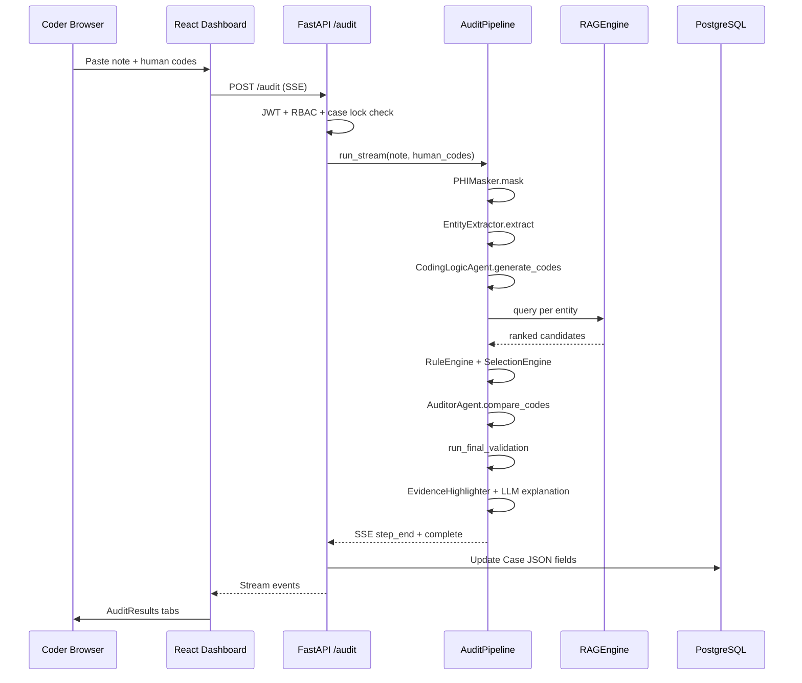

# CodePerfect Auditor — Full Project Architecture & Forensic Documentation

**Project:** JatayuS5-Lucky (CodePerfect Auditor)  
**Version (API):** 2.5.0  
**Document type:** Reverse-engineered technical architecture report (code-derived)  
**Generated from:** Actual repository inspection — not speculative design

---

## Table of Contents

1. [Project Overview](#1-project-overview)  
2. [Complete File & Folder Architecture](#2-complete-file--folder-architecture)  
3. [Frontend Architecture](#3-frontend-architecture)  
4. [Backend Architecture](#4-backend-architecture)  
5. [Database & Authentication](#5-database--authentication)  
6. [AI / Agentic Pipeline](#6-ai--agentic-pipeline)  
7. [RAG System](#7-rag-system)  
8. [Dataset & Ingestion](#8-dataset--ingestion)  
9. [Evaluation System](#9-evaluation-system)  
10. [Deployment & Docker](#10-deployment--docker)  
11. [Performance Optimizations](#11-performance-optimizations)  
12. [Security & Stability](#12-security--stability)  
13. [Complete Request Flow](#13-complete-request-flow)  
14. [Major Challenges & Solutions](#14-major-challenges--solutions)  
15. [Final Tech Stack](#15-final-tech-stack)  
16. [Final Conclusion](#16-final-conclusion)

---

## 1. Project Overview

### What the project does

**CodePerfect Auditor** is an enterprise clinical coding audit platform. It ingests unstructured clinical documentation (admission notes, operative reports, discharge summaries) and produces a **validated ICD-10 / CPT code set** with:

- Evidence-grounded code recommendations  
- Human-vs-AI discrepancy analysis  
- Explainability (rationales, removed codes, evidence spans)  
- Case workflow for coders, reviewers, and administrators  
- Optional benchmark evaluation against labeled datasets  

The system is explicitly **not** a black-box “ask the LLM for codes” product. Production architecture is **RAG-first + deterministic extraction + multi-stage governance validators**.

### Problem statement

Medical claims depend on accurate ICD-10 and CPT assignment. Errors cause:

| Risk | Impact |
|------|--------|
| **Missed codes** | Revenue leakage, incomplete clinical picture |
| **Unsupported codes** | Compliance risk, denials, audit penalties |
| **Unspecified / wrong specificity** | Downstream quality metrics, incorrect DRG grouping |
| **Symptom / external-cause noise** | Claim inflation, false clinical signals |

Manual coding is slow and inconsistent at scale. This platform automates **pre-submission audit** with traceable machine reasoning.

### AI-assisted clinical coding workflow (conceptual)

```
Clinical note → PHI mask → Entity extraction → Per-entity RAG retrieval
→ Candidate fusion & reranking → Selection competition → Rule engine
→ Terminal validator → Auditor (human compare) → Explainability → Persist case
```

### Target users

| Role | Primary activities |
|------|-------------------|
| **CODER** | Paste/upload notes, enter human codes, run audit, submit cases |
| **REVIEWER** | Review submitted cases, approve/reject, edit final code set |
| **ADMIN** | User/org management, analytics, benchmark evaluation |

### Core capabilities (implemented)

- Multi-tenant organizations and branches (`Organization`, `Branch`, `User`)  
- JWT authentication with refresh tokens  
- Streaming audit pipeline (SSE) for production UX  
- Non-streaming fast path for benchmark evaluation  
- Hybrid dense + sparse retrieval with cross-encoder reranking and SapBERT validation  
- Deterministic rule engine (hierarchy, compound codes, symptom suppression)  
- Terminal `final_validator.py` governance stack  
- Case lifecycle: `draft` → `submitted` → `in_review` → `approved` / `rejected`  
- Demo sandbox (`is_demo` flag) with environment isolation  
- PHI masking before LLM; Fernet encryption for stored notes  
- Redis optional caching of audit results  
- Admin evaluation dashboard (F1, MRR@10, nDCG@10, confusion matrix)  
- Curated presentation demo stabilization (urology, ortho, cardio, surgery, pulmonology pathways in code)

### Deployment references (from README)

- Frontend: Vercel (`codeperfect-audit.vercel.app`)  
- Backend API: Render (`codeperfect-audit.onrender.com`)  
- Docker compose targets Oracle VPS backend at `161.118.217.29:8000`  

---

## 2. Complete File & Folder Architecture

### Top-level directory tree

```
JatayuS5-Lucky/
├── backend/                 # FastAPI application root (WORKDIR in Docker)
│   ├── agents/              # Coding, auditor, evidence agents
│   ├── api/                 # HTTP route modules
│   ├── constants/           # Case status enum, normalization
│   ├── data/                # ICD/CPT CSVs, benchmarks, checkpoints
│   ├── database/            # SQLAlchemy models + async session
│   ├── prompts/             # LLM prompt templates
│   ├── scratch/             # Development / forensic scratch
│   ├── scripts/             # Backend-local eval & smoke scripts
│   ├── security/            # JWT auth dependencies
│   ├── services/            # Core pipeline services (RAG, validators, eval)
│   └── utils/               # PHI, logging, LLM client, normalizers
├── frontend/                # React + Vite SPA
│   └── src/
│       ├── components/      # Upload, audit results, sidebar
│       ├── pages/           # Dashboard, cases, analytics, evaluation
│       ├── services/        # axios API client
│       ├── data/            # sampleNotes.js (Load Sample)
│       └── styles/          # CSS (no Tailwind in package.json)
├── scripts/                 # Root ingestion (ingest_guidelines.py)
├── tests/                   # pytest suite
├── docker-compose.yml
├── Dockerfile               # Backend image
├── requirements.txt         # Python deps (repo root)
├── README.md
└── project_architecture_report.md  # This document
```

**Note:** `COMPLETE_PROJECT_ANALYSIS.md` is referenced in `README.md` but **does not exist** in the repository at time of analysis.

### Subsystem roles

| Path | Role |
|------|------|
| `backend/main.py` | FastAPI app, lifespan warmup, router mounting |
| `backend/services/audit_pipeline.py` | End-to-end orchestration |
| `backend/services/rag_engine.py` | Vector + BM25 hybrid retrieval |
| `backend/services/final_validator.py` | Terminal governance (~3k+ lines) |
| `backend/services/evaluation_engine.py` | Benchmark metrics |
| `backend/agents/coding_logic.py` | RAG-first coding agent (live path) |
| `frontend/src/main.jsx` | Routing + Auth/Audit context |
| `scripts/ingest_guidelines.py` | ChromaDB/Qdrant KB population |

---

## 3. Frontend Architecture

### Stack

| Technology | Usage |
|------------|--------|
| React 18 | UI framework |
| Vite 5 | Build tool / dev server |
| react-router-dom 6 | Client routing |
| axios | HTTP + interceptors |
| recharts | Analytics charts |
| jspdf | PDF report generation |
| lucide-react | Icons |
| Plain CSS | `index.css`, `dashboard.css`, `sidebar.css`, `auth.css` |

**Not present:** Tailwind CSS (README claim is outdated).

### Routing (`frontend/src/main.jsx`)

| Route | Roles | Page |
|-------|-------|------|
| `/login` | Public | `LoginPage` |
| `/` | CODER | `Dashboard` (audit workspace) |
| `/case-history` | ADMIN, CODER, REVIEWER | `CaseHistoryPage` |
| `/analytics` | ADMIN, REVIEWER | `AnalyticsPage` |
| `/users` | ADMIN | `UsersPage` |
| `/evaluation` | ADMIN | `Evaluation` |
| `/unauthorized` | Wrong role | Inline message |

`AdminDashboard.jsx` exists but is **not registered** in the router.

### State management

| Context | Responsibility |
|---------|----------------|
| `ThemeContext` | Dark/light theme in `localStorage` |
| `AuthContext` | User, token, role flags (`isAdmin`, `isCoder`, `isReviewer`), `GET /auth/me` validation |
| `AuditContext` | Note text, human codes, audit result, pipeline steps, file upload, running state; persisted in `sessionStorage` (`audit_state`) |

### API integration (`frontend/src/services/api.js`)

- **Base URL:** `import.meta.env.VITE_API_URL` or default `http://161.118.217.29:8000/api/v1`  
- **Auth:** Bearer token from `localStorage`; refresh on 401; `auth:expired` event  
- **Audit:** Returns stream URL `${BASE_URL}/audit`; client parses SSE `data:` JSON lines  
- **Case status compatibility:** Probes OpenAPI for `CaseStatusUpdate`; maps `in_review` ↔ legacy `pending` when old server detected  

### Coder workflow (`Dashboard.jsx`)

1. Enter clinical note (`UploadNote`) or upload file  
2. Enter human ICD/CPT codes (`CodeInput`)  
3. **Run Audit** → streaming steps + final payload  
4. Review `AuditResults` tabs: Summary, Codes, Explainability, Removed, Evidence  
5. **Submit Case** → `POST /cases/{id}/submit` when editing a draft from case history  

**Load Sample:** `frontend/src/data/sampleNotes.js` — 6 curated presentation notes (random, avoid immediate repeat).

### Reviewer / admin workflow (`CaseHistoryPage.jsx`)

- Paginated case list with filters (status, risk, dates, assignment)  
- Status transitions via `PATCH /cases/{id}/status`  
- Reject modal with structured feedback  
- Reviewer approve/reject/update-codes panels  
- Audit trail drawer + PDF export  

### Evaluation dashboard (`Evaluation.jsx`)

- Polls `GET /evaluation` and `/evaluation/status`  
- Displays F1, MRR@10, nDCG@10, confusion matrix, rejection/hallucination rationales  
- ADMIN-only route  

### How audit results render

`AuditResults.jsx` shows:

- Banner metrics (correct / missed / unsupported / confidence)  
- Per-code accept/reject feedback → `POST /feedback`  
- Explainability and evidence from backend payload (sanitized labels via `publicLabels.js`)

---

## 4. Backend Architecture

### Framework

**FastAPI** (async) with **uvicorn**, typically **2 workers** in Docker production command.

**Entry:** `backend/main.py`

```python
app = FastAPI(title="Auditor Platform", version="2.5.0", lifespan=lifespan)
```

### Routers (all prefixed `/api/v1` in `main.py`)

| Module | Prefix | Purpose |
|--------|--------|---------|
| `api/routes.py` | `/` | Audit (stream), file audit, feedback |
| `api/auth_routes.py` | `/auth` | Login, signup, users, org/branches |
| `api/case_routes.py` | `/cases` | Case CRUD + workflow |
| `api/analytics_routes.py` | `/analytics` | Overview + trends |
| `api/health.py` | `/health` | Liveness/readiness |
| `api/admin_routes.py` | `/evaluation` | Benchmark evaluation (admin) |

### Startup lifecycle (`lifespan`)

1. `init_db()` — create tables if needed  
2. Qdrant connectivity probe (if `VECTOR_DB_PROVIDER=qdrant` or `QDRANT_URL` set)  
3. `get_rag_engine()` — loads embedding model, cross-encoder, SapBERT, BM25 caches  
4. `collection_counts()` — logs ICD/CPT/guidelines/symptoms counts  
5. Production readiness summary log  

Failure to connect to Qdrant when provider is `qdrant` raises `RuntimeError` at boot.

### Middleware

- **CORS** — `settings.cors_origins` (Vercel + VPS + localhost)  
- **Observability** — request ID + duration logging  
- **slowapi** — limiter configured (`RATE_LIMIT_REQUESTS` / window) but **no route decorators** attach limits in current code  

### Production vs benchmark execution paths

| Mode | Entry | Pipeline method | LLM explanation | Evidence highlighter |
|------|-------|-----------------|-----------------|----------------------|
| **Production audit** | `POST /audit` SSE | `AuditPipeline.run_stream()` | Yes (Groq) | Yes |
| **Benchmark eval** | `GET /evaluation` | `AuditPipeline.run()` | No (deterministic fallback) | Skipped (`evidence = []`) |

Benchmark sets `settings.benchmark_mode = True` inside `evaluation_engine.run_evaluation()`.

### Key service orchestration

```
AuditPipeline
 ├── EntityExtractor
 ├── CodingLogicAgent
 ├── RuleEngine
 ├── SelectionEngine
 ├── AuditorAgent
 ├── EvidenceHighlighterAgent (stream only)
 └── run_final_validation (final_validator)
```

**Not in live audit path:** `services/agent_orchestrator.py`, `agents/clinical_reader.py`, `services/coding_logic_agent.py` (duplicate thin agent).

---

## 5. Database & Authentication

### ORM

**SQLAlchemy 2.x** async via `database/db.py`:

- Engine: `create_async_engine(settings.database_url)`  
- Session: `AsyncSessionLocal`  
- Dependency: `get_db()` for FastAPI routes  

### Core models (`database/models.py`)

| Model | Purpose |
|-------|---------|
| `Organization` | Multi-tenant org |
| `Branch` | Org branches |
| `User` | `role`: ADMIN / CODER / REVIEWER; `is_demo` |
| `Case` | Full audit case with JSON-in-Text fields for codes, evidence, pipeline log |
| `GovernanceLog` | Audit trail of state changes |
| `Document`, `AuditResult`, `AgentLog`, `FeedbackLog` | Legacy tables |

### Case fields (workflow-critical)

- `status`: `draft`, `submitted`, `in_review`, `approved`, `rejected` (see `constants/case_status.py`)  
- `ai_codes`, `human_codes`, `discrepancies`, `evidence` — serialized JSON strings  
- `assigned_to`, `locked_by`, `priority`, `reviewer_notes`, `final_code_set`  
- `is_demo` — hard isolation from production data  

### Authentication (`security/auth.py`)

| Mechanism | Implementation |
|-----------|----------------|
| Password hashing | bcrypt via `passlib` |
| Access token | JWT HS256, `type=access`, env `JWT_SECRET_KEY` |
| Refresh token | JWT `type=refresh`, httpOnly cookie in auth routes |
| Current user | `OAuth2PasswordBearer` → DB lookup |
| Role guards | `require_admin`, `require_coder`, `require_reviewer` |

**Important:** JWT signing uses `JWT_SECRET_KEY` environment variable, **not** `settings.secret_key` from `config.py`.

### PHI handling

- `PHIMasker` — masks identifiers before pipeline (`utils/phi_masker.py`)  
- `PHIEncryptor` — Fernet encryption for persistence (`utils/phi_encryptor.py`, key `PHI_ENCRYPTION_KEY`)  

### Role workflows

| Role | Typical flow |
|------|--------------|
| **CODER** | Create draft → run audit → submit for review |
| **REVIEWER** | List submitted cases → open (may auto-transition) → approve/reject/edit codes |
| **ADMIN** | User management, evaluation, assign reviewers, reopen cases, delete cases |

Environment isolation: API checks `case.is_demo == user.is_demo` on access; mismatch → 403.

---

## 6. AI / Agentic Pipeline

### Design philosophy

1. **Deterministic first** — regex/ontology extraction before LLM  
2. **Entity-level RAG** — queries per condition, not whole-note dump  
3. **Candidate union** — deterministic codes cannot be dropped by LLM  
4. **Competitive selection** — `SelectionEngine` resolves conflicts  
5. **Terminal governance** — `run_final_validation` last word on output  

### Stage 0: Entity extraction (`services/entity_extractor.py`)

**Class:** `EntityExtractor`

**Output dict keys:**

- `confirmed_entities` / `excluded_entities`  
- `deterministic_codes` — high-confidence mapped ICD/CPT  
- `rag_queries` — per-entity search strings  

Post-processing: `urology_demo_pathway.augment_entity_extraction()` for showcase notes.

### Stage 1: Coding logic (`agents/coding_logic.py`)

**Class:** `CodingLogicAgent`

| Layer | Function |
|-------|----------|
| Layer 1 | Uses pre-extracted entities (ClinicalReader removed from critical path) |
| Layer 2 | `_layer2_rag_entity_level` — `RAGEngine.query()` per entity, `RAG_TOP_K = 50` |
| Layer 3 | LLM JSON selection from candidate pool (Groq via `utils/llm_client.generate_json_async`) |

Features:

- Entity-level RAG cache (`reset_cache()` per encounter)  
- `EvidenceAggregationEngine` multi-mention fusion  
- `ClinicalRelevanceFilter` / grounding engines  
- Presentation demo RAG boosts (`get_presentation_demo_rag_boosts`, urology boosts)  

On LLM failure: returns deterministic + RAG union (no collapse to empty).

### Stage 1.5: Rule engine (`services/rule_engine.py`)

**Class:** `RuleEngine` (static methods)

- `inject_deterministic_codes` — merges ontology hits  
- `apply_hierarchy_rules` — ICD upgrades (e.g., diabetes + CKD compounds)  
- `apply_final_validation` — lightweight pass (distinct from terminal validator)  
- Integral symptom suppression map (`_INTEGRAL_SYMPTOMS`)  
- Uses `clinical_rules_config.py` for `COMPOUND_RULES`, `MANDATORY_GROUPS`, etc.

### Stage 1.5b: Selection engine (`services/selection_engine.py`)

**Class:** `SelectionEngine.select(candidates, note_text, ...)`

Responsibilities:

- Evidence-weighted scoring (`SECTION_WEIGHTS`)  
- Anatomy consistency (`check_anatomy_consistency`)  
- Hierarchy suppression / sibling pruning  
- Presentation demo stabilization (ortho intertrochanteric, cardio NSTEMI, cholecystitis, COPD) in same file  
- Urology symptom downrank via `urology_demo_pathway`  

Returns `{ selected, rejected, gold_ranks }`.

### Stage 2: Auditor (`agents/auditor.py`)

**Class:** `AuditorAgent.compare_codes(ai_codes, human_codes)`

Produces discrepancies: `correct_code`, `missed_code`, `unsupported_code` with severity.

### Stage 3–4 (stream only)

- **Explanation:** `_generate_explanation` / Groq with `prompts/clinical_explanation_prompt.txt`  
- **Evidence:** `EvidenceHighlighterAgent.highlight_evidence` — textual spans  

### Stage 6: Terminal validation (`services/final_validator.py`)

**Function:** `run_final_validation(codes, note_text) -> (diagnosis_codes, procedure_codes, rejected_traces)`

Representative governance passes (non-exhaustive; file contains 40+ `apply_*` functions):

| Pass | Purpose |
|------|---------|
| `apply_final_evidence_gate` | Textual grounding required |
| Early ortho/urology protection | Preserve fracture / obstruction codes |
| `apply_encounter_coherence_filter` | Domain consistency |
| `apply_harvesting_suppression` | Limit code harvesting |
| `apply_semantic_relative_suppression` | Drop weak relatives when driver exists |
| `apply_final_encounter_compaction` | Output size control |
| `apply_final_grounding_authority` | Evidence wins over score |
| `finalize_showcase_split` (urology) | Demo pathway finalization |

Uses `ClinicalReasoningEngine` for negation/prophylaxis checks.

### Explainability

- Per-code `rationale`, `source`, `confidence`, `audit_traces`  
- `all_final_rejections` with rejection reasons  
- API sanitization: `utils/public_labels.py` strips internal source names  

---

## 7. RAG System

**Primary implementation:** `backend/services/rag_engine.py`  
**Singleton:** `get_rag_engine()`

### Vector backends

| Backend | When active |
|---------|-------------|
| **Qdrant** | `VECTOR_DB_PROVIDER=qdrant` or `QDRANT_URL` set → `self.q_client` |
| **ChromaDB** | Fallback persistent client at `CHROMA_PERSIST_DIR` |

Logged at init: `ACTIVE_VECTOR_BACKEND = QDRANT | CHROMADB`.

**Collections (4):**

- `icd10_codes` (config: `CHROMA_COLLECTION_ICD`)  
- `cpt_codes`  
- `coding_guidelines`  
- `symptoms`  

### Embeddings (`services/embedding_service.py`)

- Default model: `BAAI/bge-small-en-v1.5` (`EMBEDDING_MODEL`)  
- `USE_LOCAL_EMBEDDINGS` — local sentence-transformers vs remote  
- Dockerfile pre-downloads `all-MiniLM-L6-v2` (legacy warmup; runtime default is BGE per config)

### Hybrid retrieval workflow (`RAGEngine.query`)

```
1. Normalize query (terminology, truncation MAX_QUERY_CHARS)
2. Intent routing (instructional vs clinical)
3. Anatomy extraction (ANATOMY_HIERARCHY map)
4. Parallel per-collection fetch:
   - Dense: Qdrant query_points OR Chroma query_embeddings
   - Sparse: FastBM25 (_sparse_search, bm25_cache.pkl)
5. Merge candidates by code
6. Hybrid score: 0.6 * dense + 0.4 * sparse  (hardcoded; settings rag_hybrid_alpha/beta logged but not used in blend)
7. Cross-encoder rerank: cross-encoder/ms-marco-MiniLM-L-6-v2
8. SapBERT validation: SemanticOntologyValidator (cambridgeltl/SapBERT-from-PubMedBERT-fulltext)
9. Grounding filter + CodingDecisionEngine adjustments
10. Return ranked candidates with timings dict
```

### BM25 (`FastBM25`)

- SciPy CSR-accelerated implementation  
- Cached tokenized corpora in `bm25_cache.pkl`  
- Sub-10ms sparse search target per module comments  

### SapBERT

- `services/ontology_validator.py` — `validate_candidates()` re-scores top-k after cross-encoder  
- Benchmark early exit: if top score > 0.95 and `benchmark_mode`, SapBERT skipped  

### Anatomy / specificity

- `ANATOMY_HIERARCHY` — region keyword groups  
- `CodingDecisionEngine` — post-rerank clinical decision scoring  
- `validation_utils.clinical_specificity_score` — used in selection  

### Forensic tooling

- `services/forensic_topk_analyzer.py` — `analyze_top_k` for debug  
- RAG logs: `RETRIEVAL_DEPTH`, `RERANKER_APPLIED`, `SAPBERT_APPLIED`  

---

## 8. Dataset & Ingestion

### Source data (`backend/data/`)

| File | Content |
|------|---------|
| `icd10_codes.csv` | ICD-10 code descriptions |
| `cpt_codes.csv` | CPT procedures |
| `symptom_dataset.csv` | Symptom concepts |
| `coding_guidelines.txt` | Narrative guidelines |
| `FY2025_raw_guidelines.txt`, `FY2026_raw_guidelines.txt` | Guideline corpora |

### Ingestion script

**`scripts/ingest_guidelines.py`**

- Uses `GuidelineLoader` → `RAGEngine`  
- Safety lock: refuses overwrite if production-scale counts exist unless `--force`  
- Flags: `--reset-all`, `--reset-cpt`, `--backup`  
- Populates Chroma collections (and Qdrant when configured via same RAG engine upsert paths)

### Benchmark datasets

| File | Usage |
|------|-------|
| `benchmark_standardized.json` | Default admin evaluation |
| `benchmark_expanded.json` | Extended eval scripts |
| `benchmark_holdout.json` | Holdout testing |
| `diagnostic_subset.json` | Diagnostics |
| `adversarial_benchmark.json` | Adversarial cases |

Case schema includes `expected_codes` / `ground_truth` and note text.

### Chunking / indexing strategy (from code behavior)

- Codes stored as document + metadata (`code`, `description`, collection label)  
- Embeddings generated in batches (`EMBEDDING_BATCH_SIZE`, retries, concurrency limits)  
- Checkpoints: `backend/data/checkpoints/ingestion_progress.json`  

---

## 9. Evaluation System

### Engine

**File:** `backend/services/evaluation_engine.py`  
**Entry:** `run_evaluation(dataset_path, mode, force_refresh)`

### Flow

1. Load JSON benchmark cases  
2. Set `settings.benchmark_mode = True`  
3. For each case: `AuditPipeline.run()` (non-streaming)  
4. Compare predictions vs `expected_codes` (dot-stripped normalization)  
5. Aggregate metrics; persist to `data/checkpoints/latest_evaluation.json`  

### Metrics computed (actual code)

| Metric | Description |
|--------|-------------|
| **Precision / Recall / F1** | Set overlap on normalized codes |
| **Hierarchy F1** | 3-character prefix family match |
| **MRR@10** | Mean reciprocal rank of first correct code in ordered list |
| **nDCG@10** | `_calculate_ndcg` with partial credit |
| **Top-1 accuracy** | First prediction exact match rate |
| **Confusion matrix** | TP, FP, FN, TN aggregates |
| **Dangerous FP** | Prefixes: I21, I63, A41, J96, S72, I82, J18, etc. |
| **Failure taxonomy** | hallucination, anatomy_mismatch, specificity_downgrade, prophylaxis_hallucination, … |
| **Audit trail insights** | Top rejection / hallucination rationales |

### Admin API

`GET /api/v1/evaluation?force_refresh=` — `require_admin` — calls `run_evaluation(BENCHMARK_PATH)`.

### Frontend display

`Evaluation.jsx` shows F1, MRR@10, nDCG@10, confusion matrix, false positive / missed code averages — **no Accuracy card** in current UI (removed in prior UI cleanup).

### Related scripts

- `backend/scripts/rag_production_eval.py` — detailed evaluation runner  
- `backend/scripts/task_50_forensics.py`, `task_51_validation.py` — forensic validation tasks  

---

## 10. Deployment & Docker

### `docker-compose.yml` (actual services)

| Service | Image | Port | Command |
|---------|-------|------|---------|
| `backend` | Build `Dockerfile` | 8000 | `uvicorn main:app --workers 2` |
| `frontend` | `node:20-alpine` | 3000 | `npm run dev` (Vite dev, not nginx prod stage) |

**Volumes:** `chroma_data`, `hf_cache`, `pdf_reports`, `checkpoints`, `frontend_node_modules`

**Not in compose:** PostgreSQL, Redis, Qdrant (production uses external Neon + Qdrant Cloud per comments)

### `Dockerfile` (backend)

- Python 3.11-slim  
- Installs `requirements.txt` from repo root  
- Pre-downloads `all-MiniLM-L6-v2`  
- Copies `backend/`, `scripts/`, `.env.prod`  
- Healthcheck: `GET /api/v1/health/live`  

### `frontend/Dockerfile`

- Multi-stage Vite build → nginx on port 80  
- **Not used** by current compose (compose runs Vite dev server instead)

### Environment files

Loaded by `config.py`: `ROOT_DIR/.env`, `.env.prod`, `backend/.env.prod`

### Oracle VPS pattern

- Frontend container points `VITE_API_URL` to `http://161.118.217.29:8000/api/v1`  
- Backend bound `0.0.0.0:8000` with 2 workers  

### Networking

- Frontend depends_on backend  
- CORS allows VPS frontend origin  

---

## 11. Performance Optimizations

| Technique | Location | Effect |
|-----------|----------|--------|
| **Benchmark mode** | `BENCHMARK_MODE=True` | Skips LLM explanation, evidence agent, SapBERT early exit |
| **RAG singleton** | `get_rag_engine()` | One model load per process |
| **Entity RAG cache** | `CodingLogicAgent._rag_cache` | Per-encounter query dedup |
| **Redis audit cache** | `api/routes.py` | Key = note hash + human codes |
| **Async gather** | `rag_engine.query` | Parallel collection fetches |
| **FastBM25 CSR** | `FastBM25` | Fast sparse leg |
| **Early termination** | RAG score > 0.95 in benchmark | Skip SapBERT |
| **Evaluation disk cache** | `latest_evaluation.json` | Skip re-run unless `force_refresh` |
| **Groq fast model** | `GROQ_MODEL_FAST` | Fallback tier |
| **`ENABLE_LLM_REASONING=False`** | config default | Reduces LLM depth in coding |
| **uvicorn workers=2** | docker-compose | Process-level parallelism |
| **Startup warmup** | `lifespan` | Loads RAG before accepting traffic |

### Groq usage

Primary LLM: **Groq** (`llama-3.3-70b-versatile`), not Google Gemini (README outdated).  
`utils/llm_client.generate_json_async` enforces JSON responses.

---

## 12. Security & Stability

| Control | Implementation |
|---------|----------------|
| RBAC | Role dependencies on routes; REVIEWER blocked from initiating audits |
| Demo isolation | `is_demo` match on case access |
| Draft-only audit | Non-draft cases cannot re-audit from coder path |
| Case locking | `locked_by` / `locked_at` fields (10-minute reviewer lock per README) |
| JWT expiry | Access 15 min default; refresh 7 days |
| PHI mask + encrypt | Before LLM; at rest in DB |
| Governance logging | `log_governance()` on sensitive actions |
| Ingestion lock | Prevents accidental KB wipe |
| Error handling | Pipeline stages try/except with fallback to deterministic codes |
| Request tracing | Request ID in observability middleware |
| API sanitization | `sanitize_audit_payload_for_api` hides internal pathway labels |

### Logging

Structured logging via `utils/logging.py` — RAG timings, lifecycle counts, validator traces at DEBUG.

---

## 13. Complete Request Flow

### Production audit (coder)



### Step-by-step (aligned to code)

| Step | Component | Output |
|------|-----------|--------|
| 1 | User submits note | Raw text + optional `case_id` |
| 2 | `PHIMasker` | Masked note |
| 3 | `EntityExtractor` | Deterministic codes + RAG queries |
| 4 | `CodingLogicAgent` | Candidate pool from RAG + LLM selection |
| 5 | `RuleEngine` | Injected codes, hierarchy upgrades, human seeds |
| 6 | `SelectionEngine` | Competed final candidate set |
| 7 | `AuditorAgent` | Discrepancies vs human codes |
| 8 | `run_final_validation` | Split ICD/CPT, rejections |
| 9 | `EvidenceHighlighter` | Spans (stream only) |
| 10 | `sanitize_audit_payload_for_api` | Client-safe JSON |
| 11 | Case persistence | `ai_codes`, metrics, `pipeline_log` |
| 12 | Frontend render | Summary / codes / explainability |

### Benchmark evaluation flow

```
Admin → GET /evaluation → run_evaluation → AuditPipeline.run (fast)
→ per-case metrics → aggregate F1/MRR/nDCG → cache JSON → Evaluation UI poll
```

---

## 14. Major Challenges & Solutions

| Challenge | Evidence in codebase | Mitigation |
|-----------|---------------------|------------|
| **LLM hallucination** | Black-box coding rejected in architecture | RAG-constrained pool; validator evidence gate; deterministic injection |
| **Retrieval specificity loss** | Unspecified fracture / generic MI in demos | Selection engine presentation boosts; fracture/NSTEMI showcase detectors; SapBERT + cross-encoder |
| **Validator collapse (zero codes)** | `FINAL_VALIDATOR_PRESERVE_N` rescue | Protected snapshots; early ortho/urology protection |
| **Symptom / external-cause noise** | R52, W19, R07.9 in wrong outputs | Integral symptom maps; urology/ortho/cardio downrank gates |
| **Prophylactic DVT coding** | I82 without documented DVT | `has_prophylaxis_context`; ortho showcase blocks speculative I82 |
| **Benchmark runtime** | Full pipeline slow | `run()` skips explanation/evidence; benchmark_mode SapBERT skip; evaluation cache |
| **Groq rate limits** | Retries in llm client | `AGENT_MAX_RETRIES`; fallback to deterministic+RAG |
| **Wrong vector backend empty** | Boot checks collection counts | RuntimeError if Qdrant collections empty in prod mode |
| **Frontend/backend status drift** | `in_review` vs `pending` | OpenAPI detection + legacy mapping in `api.js` |
| **README vs code drift** | Gemini/Tailwind/Postgres in compose | This document reflects **code truth** |

---

## 15. Final Tech Stack

### Frontend

| Layer | Technology |
|-------|------------|
| UI | React 18, Vite 5 |
| Routing | react-router-dom 6 |
| HTTP | axios |
| Charts | recharts |
| PDF | jspdf |
| Styling | Custom CSS variables |

### Backend

| Layer | Technology |
|-------|------------|
| API | FastAPI, uvicorn, pydantic-settings |
| DB | PostgreSQL via SQLAlchemy async + asyncpg |
| Cache | Redis (optional, hiredis) |
| Auth | python-jose JWT, passlib bcrypt |
| PHI | cryptography Fernet |

### ML / retrieval

| Component | Model / library |
|-----------|-----------------|
| Embeddings | BAAI/bge-small-en-v1.5 (config default) |
| Cross-encoder | ms-marco-MiniLM-L-6-v2 |
| SapBERT | cambridgeltl/SapBERT-from-PubMedBERT-fulltext |
| Sparse | rank_bm25 + custom FastBM25 |
| Vector DB | Qdrant (prod) / ChromaDB (fallback) |
| LLM | Groq API (Llama 3.3 70B / 3.1 8B) |
| Framework | sentence-transformers, torch, transformers |

### Deployment

| Layer | Technology |
|-------|------------|
| Containers | Docker, docker-compose |
| Frontend hosting | Vercel (README) |
| Backend hosting | Render + Oracle VPS (compose) |
| DB hosting | Neon PostgreSQL (README / DATABASE_URL pattern) |

---

## 16. Final Conclusion

### Strengths

1. **Defensive architecture** — Multiple independent gates (extraction, selection, rules, terminal validator) reduce single-point LLM failure.  
2. **Explainable output** — Rationales, rejection traces, evidence spans, and discrepancy typing support CDI workflows.  
3. **Operational maturity** — Multi-tenant RBAC, demo isolation, case lifecycle, governance logs, and health endpoints.  
4. **Retrieval depth** — True hybrid dense+sparse with cross-encoder and biomedical SapBERT validation is uncommon in student/internship projects.  
5. **Measurable quality loop** — Built-in benchmark engine with MRR, nDCG, dangerous FP tracking.  

### Intelligent capabilities

- Entity-level retrieval with anatomy and procedure intent routing  
- Deterministic ontology mapping with negation awareness  
- Competitive code selection with mandatory groups and hierarchy suppression  
- Presentation-grade demo stabilization without global benchmark retuning  

### Architecture quality

The codebase is **large and production-oriented** (`final_validator.py` alone is a substantial governance subsystem). Separation between `agents/`, `services/`, and `api/` is clear. Some legacy paths (`AgentOrchestrator`, `ClinicalReader`, duplicate `CodingLogicAgent` in services) remain but are not wired to the live audit route.

### Production-readiness notes

| Ready | Gap / caveat |
|-------|----------------|
| Dockerized backend with health checks | Compose lacks DB/Redis services |
| Qdrant boot validation | README still mentions Chroma-only |
| JWT + RBAC | Rate limiter not applied to routes |
| SSE streaming audit | Case status API version mismatch on older deployments |
| Evaluation cache | Long benchmark runs still heavy without warmup cluster |

### Future improvements (observed from code, not roadmap promises)

1. Align README with Groq + BGE + Qdrant reality  
2. Restore `COMPLETE_PROJECT_ANALYSIS.md` or remove README reference  
3. Apply `slowapi` limits to `/audit`  
4. Use `rag_hybrid_alpha/beta` in actual blend or remove unused settings  
5. Production frontend via nginx `frontend/Dockerfile` instead of Vite dev in compose  
6. Consolidate demo pathways into a single `presentation_demo_pathway.py` module  

---

## Appendix A — Key file reference

| Concern | File |
|---------|------|
| App entry | `backend/main.py` |
| Audit orchestration | `backend/services/audit_pipeline.py` |
| RAG | `backend/services/rag_engine.py` |
| Coding | `backend/agents/coding_logic.py` |
| Selection | `backend/services/selection_engine.py` |
| Terminal validation | `backend/services/final_validator.py` |
| Rules | `backend/services/rule_engine.py` |
| Clinical config | `backend/services/clinical_rules_config.py` |
| Evaluation | `backend/services/evaluation_engine.py` |
| Urology demo | `backend/services/urology_demo_pathway.py` |
| Config | `backend/config.py` |
| Models | `backend/database/models.py` |
| Auth | `backend/security/auth.py` |
| Audit API | `backend/api/routes.py` |
| Frontend entry | `frontend/src/main.jsx` |
| API client | `frontend/src/services/api.js` |
| Sample notes | `frontend/src/data/sampleNotes.js` |
| Ingestion | `scripts/ingest_guidelines.py` |

---

## Appendix B — API route summary

| Method | Path | Auth |
|--------|------|------|
| POST | `/api/v1/audit` | CODER/ADMIN (not REVIEWER) |
| POST | `/api/v1/audit/file` | Same |
| POST | `/api/v1/feedback` | Authenticated |
| POST | `/api/v1/auth/login` | Public |
| GET | `/api/v1/auth/me` | Authenticated |
| GET | `/api/v1/cases` | Authenticated |
| PATCH | `/api/v1/cases/{id}/status` | Role-dependent |
| GET | `/api/v1/evaluation` | ADMIN |
| GET | `/api/v1/health/live` | Public |

---

*End of report. All descriptions trace to repository source as of document generation. For discrepancies between this report and `README.md`, prefer this report and the cited source files.*
